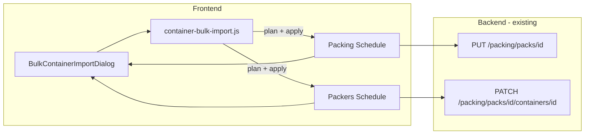

# Bulk container number import

## Problem we are trying to solve

### Background

On a packing schedule, logistics staff set up a pack with:

1. **How many containers** are required (`containersRequired`)
2. **Release lines** — pickup references with an empty container park and transporter
3. **Draft container slots** — one per required container, usually without container numbers at first

Historically, **packers entered container numbers one at a time** on the Packers Schedule as containers arrived on site. Release, park, and transporter were pre-filled from the pack when there was only one release line.

### New requirement

Container numbers are sometimes known **before** containers arrive. Users need to:

- **Bulk paste** a list of container numbers (one per line, or comma/tab separated)
- **Choose which release** the import belongs to
- **Explicitly select** the empty container park and transporter for that batch
- Apply those numbers to the pack’s empty container slots with the correct logistics details
- Do this from **both** the Packing Schedule (planning) and the Packers Schedule (operational)

### Constraints

- Container count is still controlled by `containersRequired` — import cannot exceed the number of **empty** slots; the user must increase the count first if needed
- Releases on the pack and master release records in reference data are related but not strictly 1:1 with container slots
- Multi-release packs must allow the user to pick release + park + transporter per import batch

---

## What has been implemented (frontend)

### New files

| File | Purpose |
|------|---------|
| [`lib/container-bulk-import.js`](../lib/container-bulk-import.js) | Parse pasted numbers, plan slot assignment, apply patches with release/park/transporter |
| [`components/packing-schedule/bulk-container-import-dialog.jsx`](../components/packing-schedule/bulk-container-import-dialog.jsx) | Shared modal UI |

### Dialog behaviour

1. **Logistics selection** (all required before pasting):
   - **Release** — `ClutchSelect`, options from pack release lines + reference-data releases
   - **Empty Container Park** — `ClutchSelect`, all parks from lookups; pre-filled when release is chosen
   - **Transporter** — `ClutchSelect`, all transporters from lookups; pre-filled when release is chosen

2. Selecting a release **pre-fills** park and transporter from the release’s first park (same behaviour as the pack form release row). The user can override park or transporter before importing.

3. **Paste area** — container numbers, uppercased and deduplicated

4. **Preview table** — maps each number to a slot; shows conflicts when a number already exists on another slot (Skip / Overwrite per row)

5. **Blocking rules**:
   - More numbers than empty slots → blocked; user must raise **Containers Required**
   - Duplicate numbers in paste → warning; first occurrence kept

6. **On confirm**, each affected container slot receives:
   - `containerNumber` / `containerNo`
   - `releaseNumber`
   - `emptyContainerParkId`
   - `transporterId`
   - `releasePark` / `transporter` (display names)

### Integration points

| Screen | Entry | Persist path |
|--------|-------|--------------|
| **Packing Schedule** — [`app/packing-schedule/new-pack-form/page.jsx`](../app/packing-schedule/new-pack-form/page.jsx) | “Bulk import containers” button near release section | Updates local `pack.containers`; user **Save pack** via existing `savePack` PUT |
| **Packers Schedule** — [`app/packers-schedule/[id]/pack-detail-client.jsx`](../app/packers-schedule/[id]/pack-detail-client.jsx) | “Bulk import” button above container list | Updates local work drafts, then **sequential PATCH** per container via `updateContainer` |

### Slot assignment logic

Empty slots are filled in order:

1. Empty slots whose existing `releaseNumber` matches the selected release
2. Other empty slots

Sorted by container `order` within each group.

### Other UI fixes

- `ClutchSelect` menu portal z-index raised to `9999` in [`components/custom/ClutchSelect.js`](../components/custom/ClutchSelect.js) so dropdowns work inside modals
- Release options merge pack lines (park/transporter from pack) with reference-data releases (from `/reference-data/releases`)

---

## Backend changes

### Required for current feature: **none**

The existing Packing module API already supports everything the UI sends.

| Operation | Endpoint | Relevant fields |
|-----------|----------|-----------------|
| Save whole pack (planning) | `PUT /api/packing/packs/{id}` | `containers[]` with `container_number`, `release_number`, `empty_container_park_id`, `transporter_id` |
| Update single container (packers) | `PATCH /api/packing/packs/{pack}/containers/{container}` | Same fields via `containerValidationRules()` in [`PackController.php`](../../clutch-packing/Modules/Packing/app/Http/Controllers/PackController.php) |

Pack releases continue to use `pack_releases` (`release_ref`, `empty_container_park_id`, `transporter_id`). Container slots store their own copy of release/park/transporter — there is no FK from container to a specific pack release line ID; matching is by `release_number` string.

Reference releases come from `Modules/ReferenceData` (`/api/reference-data/releases`) and are read-only for this feature.

### Optional future backend improvements

These are **not required** for the current UI to work but may be worth adding later:

| Enhancement | Why | Suggested shape |
|-------------|-----|-----------------|
| **Bulk container PATCH endpoint** | Packers path currently sends one PATCH per imported container; slow for 40+ containers | `PATCH /api/packing/packs/{pack}/containers/bulk` accepting `{ containers: [{ id, container_number, release_number, empty_container_park_id, transporter_id }] }` in one transaction |
| **Duplicate container number validation** | UI allows free-text numbers; backend could reject duplicates within a pack or tenant | Validation rule on `container_number` uniqueness per pack (or org) |
| **ISO 6346 check-digit validation** | Optional stricter validation if business requires it | Custom rule on `container_number` |
| **FK from container → pack_release** | Today release link is a loose string match; a FK would enforce integrity | New `pack_release_id` on `pack_containers` (schema + migration + API) |
| **Auto-sync pack release line on import** | If user imports against a reference release not yet on the pack, optionally append a `pack_releases` row | Logic in pack update or dedicated endpoint |

### Backend verification checklist

When testing end-to-end with the API running:

1. Create/edit pack with `containers_required` ≥ import count
2. Bulk import from pack form → save pack → confirm `pack_containers.container_number`, `release_number`, `empty_container_park_id`, `transporter_id` persisted
3. Bulk import from packers → confirm PATCH responses and data after refresh
4. Multi-release pack → confirm imported containers carry the selected release/park/transporter, not another release line’s defaults

---

## Data flow (summary)

---

## Out of scope (v1)

- CSV / file upload (paste only)
- Per-release slot quotas (e.g. “exactly N containers per release line”)
- Retroactive update of pack `releaseDetails` when importing against a reference release not yet on the pack
