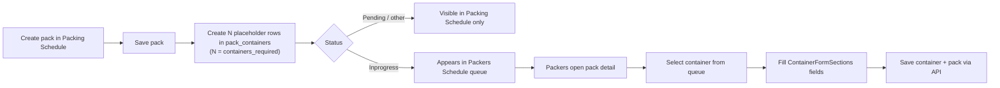

# Packers Schedule — objective and data flow

This document explains how the **Packers Schedule** builds on **Packing Schedule** data, what each module is responsible for, and every container field the existing packers form expects. It is written for backend and full-stack implementers wiring real API persistence.

> **See also:** [`packers-schedule-spec-addendum.md`](packers-schedule-spec-addendum.md) — covers persistence semantics, the (currently simulated) PRA integration, concurrency, auth/tenant scoping, the real PEMS endpoints, and the lookup data sources that are **not** served by the packing API.

**Related UI (do not change the form layout):**

| Screen | Path | Key files |
|--------|------|-----------|
| Packing Schedule list | `/packing-schedule` | `app/packing-schedule/page.jsx` |
| New / edit pack | `/packing-schedule/new-pack-form` | `app/packing-schedule/new-pack-form/page.jsx` |
| Packers Schedule queue | `/packers-schedule` | `app/packers-schedule/packers-schedule-client.jsx` |
| Pack detail (container entry) | `/packers-schedule/[id]` | `app/packers-schedule/[id]/pack-detail-client.jsx` |
| Container form sections | (shared component) | `components/pems/container-form-sections.jsx` |

**Related backend:**

- `clutch-packing/Modules/Packing/` — `packs`, `pack_containers`, `PackController::syncContainers`
- PEMS submission tables — see [`pems-backend-guide.md`](pems-backend-guide.md)

---

## 1. High-level objective

| Module | Who uses it | Purpose |
|--------|-------------|---------|
| **Packing Schedule** | Planners / office staff | Create and plan export/import packs: customer, vessel, commodity, container count, releases, documents, fumigation, packer assignments, and overall **status**. |
| **Packers Schedule** | Packers on the floor | Work **Inprogress** container packs: open each placeholder container, enter operational details (number, seal, weights, inspections, PRA), and save. |

The Packers Schedule is **not** where packs are created. It is the operational workspace that appears **after** a pack has been planned and its status moved to **`Inprogress`**.

---

## 2. End-to-end workflow



### Step 1 — Pack entered in Packing Schedule

When a planner saves a pack (create or update), the frontend builds a `containers` array with exactly **`containersRequired`** placeholder rows.

Frontend logic (`buildPackContainers` in `new-pack-form/page.jsx`):

- Count = `Math.max(Number(pack.containersRequired || 0), 0)`
- One draft object per index (`order` = 1…N)
- Initial values are mostly empty; status defaults to **`Draft`**
- Pack-level defaults flow in where relevant (e.g. `containerCode`, `packingStartDate`)

The save payload includes this array. The backend `PackController::syncContainers` creates or resizes rows in **`pack_containers`**:

- Preserves existing rows **by order index** when count increases (e.g. 2 → 4 keeps rows 1–2, adds empty rows 3–4)
- Deletes and re-inserts in order when count changes (see test `container normalization 2→4` in `PackControllerTest.php`)
- Default container **status** = **`Draft`**

**Rule:** `containers_required` on the pack and the number of `pack_containers` rows must always stay in sync.

### Step 2 — Status changes to Inprogress

Pack statuses (from `lib/Data.js` → `PACK_STATUSES`):

`Pending` → **`Inprogress`** → `Awaiting Approval` → `Pending Fumigation` → `Approved` → `Invoiced` → `Completed`

The Packers Schedule queue loads packs where:

```js
fetchPackRows({ status: "Inprogress" })
// filtered again client-side: row.status === "Inprogress"
```

Only **`Inprogress`** packs appear in `/packers-schedule`. Changing status back to `Pending` removes the pack from the packers queue.

Bulk and non-container packs (`packType !== "container"` or `containersRequired === 0`) are out of scope for this container workflow.

### Step 3 — Packers enter and save container details

On `/packers-schedule/[id]`:

1. Load the pack via `GET /api/packing/packs/{id}`
2. Merge pack containers with local work drafts via `syncWorkDrafts` (`lib/packers-work-store.js`)
3. Packer selects a container from the left **Container queue**
4. Edits fields rendered by **`ContainerFormSections`** (unchanged form)
5. On change, work is persisted to:
   - **localStorage** (`packing-ui-packers-work-v1`) for in-progress drafts
   - **API** via `savePack` → `PUT /api/packing/packs/{id}` with updated `containers` array

Pack-level read-only context (customer, commodity, job ref, cut-off, packing note, attachments) comes from the pack record created in Packing Schedule. Packers also complete **pre-pack checks** on the pack (`packChecks`) before/during work.

---

## 3. What Packing Schedule provides to Packers Schedule

### 3.1 Pack header (mostly read-only in packers UI)

These fields are set in Packing Schedule and displayed on the pack detail screen:

| Field | Purpose in packers UI |
|-------|----------------------|
| `id`, `jobReference` | Pack identity |
| `customer`, `commodity` | Context banners |
| `containersRequired`, `mtTotal` | Progress denominators; weight-per-container hint |
| `vesselCutoffDate`, `fumigation` | Planning context |
| `jobNotes` / `packingNote` | Amber **Packing note** banner (pack + per-container) |
| `releaseDetails` | Release refs summary |
| `importPermitRequired`, `importPermitNumber`, `importPermitDate` | Permit line in attachments section |
| `importPermitFiles`, `rfpFiles`, `packingInstructionFiles`, `additionalDeclarationFiles` | Document quick-look |
| `containerCode` | Default ISO / size mapping for containers |
| `packingStartDate` / `date` | Default container start date |
| `rfp`, `destinationCountry`, `exporter`, etc. | Used on **PEMs** tab submissions |

### 3.2 Placeholder containers (created at pack save)

Each placeholder row at creation time includes (Packing Schedule / `createDraftContainer` shape):

| Field | Initial value |
|-------|---------------|
| `id` | Generated client-side, replaced by UUID from API after save |
| `packId` | Parent pack id |
| `order` | 1…N |
| `containerNumber` | `""` |
| `containerCode` | From pack |
| `containerIsoCode` | Derived from container code or `""` |
| `sealNumber` | `""` |
| `releaseNumber`, `releasePark`, `transporter` | `""` (may later pre-fill from release details) |
| `emptyContainerParkId`, `transporterId` | From release row when mapped |
| `startDate` | `pack.packingStartDate` |
| `startHour`, `startMinute` | `""` |
| `grainLocation`, `stockBayId` | `""` |
| Weight fields | `""` until packer enters |
| Inspection / signoff fields | Defaults (`Pending`, `No`, etc.) |
| `status` | **`Draft`** |

### 3.3 Pack-level editable in Packers Schedule (not on container form)

| Field group | Keys | Where stored today |
|-------------|------|-------------------|
| Pre-pack checks | `importDetailsChecked`, `sampleRequirementsChecked`, `rfpDetailsChecked`, `micorRequirementsChecked` | Work draft → should persist on pack or separate table |
| PEMs batch draft | `pemsDraft` (record type, inspection times, AO, staged container ids, comments) | Work draft + `pack_pems_submissions` on submit |
| PEMs submissions history | `pemsSubmissions[]` | `pack_pems_submissions` |

---

## 4. Container fields required by the packers form

The packers UI uses `ContainerFormSections` with `showPackersNote={true}`. **Do not change this component** when implementing the backend — map API data to these keys instead.

Work-store field names (`packers-work-store.js`) differ slightly from Packing Schedule save shape. The form reads the **work-store / camelCase** names below.

### 4.1 Packing Order

| Form label | Work-store key | Type | Notes |
|------------|----------------|------|-------|
| Container No | `containerNo` | string | Maps to API `container_number` |
| Seal No | `sealNo` | string | Maps to API `seal_number` |
| Container ISO | `isoCode` | select | Options in UI: `22G1`, `42G1`, `45G1`, `L5G1` |
| Start Time — date | `startDate` | date (`YYYY-MM-DD`) | |
| Start Time — hour | `startHour` | string (`00`–`23`) | 24-hour |
| Start Time — minute | `startMinute` | string | `00`, `05`, … `55` |
| Stock/Bay ID | `stockBayId` | select | Lookup: stock locations |
| Grain location | `grainLocation` | string | Free text / silo reference |

### 4.2 Weights

| Form label | Work-store key | Type | Notes |
|------------|----------------|------|-------|
| Tare | `tare` | decimal | MT; packer-entered |
| Gross Weight | `grossWeight` | decimal | MT; packer-entered |
| Nett Weight | `nettWeight` | decimal | **Read-only in form** — computed as `grossWeight - tare` (rounded 2 dp) on change |
| Container tare weight | `containerTareWeight` | decimal | Empty container tare |

### 4.3 Release Details

| Form label | Work-store key | Type | Notes |
|------------|----------------|------|-------|
| Release Number | `releaseNumber` | string | May pre-fill from pack releases |
| Container Park | `releasePark` | string | Display name; schedule may store `emptyContainerParkId` |
| Transporter | `transporter` | string | Display name; schedule may store `transporterId` |

### 4.4 Signoff

| Form label | Work-store key | Type | Options / notes |
|------------|----------------|------|---------------|
| Packer signoff | `packerSignoff` | select | Active packers from form-data API |
| Out-loaded? | `outLoaded` | select | `No`, `Yes` |
| PRA signoff | `praSignoff` | select | Active packers |
| PRA template | `praTemplate` | select | `Original`, `Resubmit`, `Correction` |
| *(actions)* | — | buttons | Reset container, Mark packed, Submit PRA |
| PRA state | `praSubmitted` | boolean | Display only in form footer |

### 4.5 1-Stop PRA Info

| Form label | Work-store key | Type | Options |
|------------|----------------|------|---------|
| PRA last status | `praLastStatus` | select | `Pending`, `Accepted`, `Rejected`, `Error` |
| PRA last submitted time | `praLastSubmittedTime` | string | Timestamp / display string |
| PRA last error | `praLastError` | string | Integration error message |

### 4.6 Authorised Officer Inspection

| Form label | Work-store key | Type | Options |
|------------|----------------|------|---------|
| Empty container inspection | `emptyInspection` | select | `Pending`, `Passed`, `Failed` |
| Grain inspection | `grainInspection` | select | `Pending`, `Passed`, `Failed` |
| Inspection level (PEMS) | `inspectionLevelCode` | select | `Consumable`, `Standard` |
| Passed after rectification | `passedAfterRectification` | select | `N`, `Y` |
| AO signoff | `aoSignoff` | select | Authorised officers / packers list |
| Inspection remark code | `inspectionRemarkCode` | select | Optional; from PEMS reference data when provided |
| Container inspection remark (notes) | `aoInspectionRemark` | textarea | Also referenced as `CONTAINER_INSPECTION_REMARK_FIELD` in `lib/pems-container-fields.js` |

### 4.7 Packers note (packers schedule only)

| Form label | Work-store key | Type | Notes |
|------------|----------------|------|-------|
| Packers note | `packerNotes` | textarea | Per-container free-text notes |

### 4.8 System / derived fields (not all shown as inputs)

These are used for queue badges, save payloads, and PEMs/PRA integration. Backend should persist them even though some are not direct form inputs.

| Key | Purpose |
|-----|---------|
| `id` | Container UUID |
| `order` | Position 1…N in pack |
| `status` | Derived stage label — see §5 |
| `containerNotes` | Internal notes (work-store; not on main form) |
| `ecrSubmitted`, `ecrLastSubmittedAt`, `ecrLastBatchId` | Empty Container Inspection (PEMS ECI) tracking |
| `gppirSubmitted`, `gppirLastSubmittedAt`, `gppirLastBatchId` | Grain and Plant Product Inspection Record tracking |
| `inspectionResultCode` | PEMS result code |
| `packageType`, `packageUnit`, `sampled`, `lineNumber`, `samplingType`, `inlineSamplingType` | PEMS payload defaults from `defaultContainerPemsFields()` |

---

## 5. Container stage (progress badge)

`containerStage()` in `lib/packers-work-store.js` computes the badge shown in the container queue:

| Stage | Condition |
|-------|-----------|
| **Complete** | PRA accepted **and** all mandatory checks done |
| **PRA Passed** | PRA accepted, checks incomplete |
| **PRA Failed** | PRA rejected or error |
| **PRA Submitted** | `praSubmitted === true`, awaiting result |
| **Packing** | Default — details still being entered |

Mandatory checks for **Complete** (also shown as missing-checks banner on the form):

- `packerSignoff` set
- `outLoaded === "Yes"`
- `emptyInspection === "Passed"`
- `grainInspection === "Passed"`
- `aoSignoff` set

Pack-level PRA progress in the grid: count of containers with `praSubmitted === true` over `containersRequired`.

---

## 6. API and naming conventions

The API accepts **snake_case** and **camelCase** (see `PackController`). Recommended mapping for container persistence:

| Work-store / form (camelCase) | API / DB (snake_case) |
|------------------------------|------------------------|
| `containerNo` | `container_number` |
| `sealNo` | `seal_number` |
| `isoCode` | `container_iso_code` |
| `containerCodeId` | `container_code_id` |
| `releaseNumber` | `release_number` |
| `emptyContainerParkId` | `empty_container_park_id` |
| `transporterId` | `transporter_id` |
| `startDate` | `start_date` |
| `startHour` | `start_hour` |
| `startMinute` | `start_minute` |
| `stockBayId` | `stock_bay_id` |
| `grainLocation` | `grain_location` |
| `grossWeight` | `gross_weight` |
| `nettWeight` | `nett_weight` |
| `containerTareWeight` | `container_tare_weight` |
| `packerSignoff` | `packer_signoff` |
| `outLoaded` | `out_loaded` |
| `praSignoff` | `pra_signoff` |
| `praTemplate` | `pra_template` |
| `praSubmitted` | `pra_submitted` |
| `praLastStatus` | `pra_last_status` |
| `praLastSubmittedTime` | `pra_last_submitted_at` |
| `praLastError` | `pra_last_error` |
| `emptyInspection` | `empty_inspection` |
| `grainInspection` | `grain_inspection` |
| `inspectionLevelCode` | `inspection_level_code` |
| `passedAfterRectification` | `passed_after_rectification` |
| `inspectionRemarkCode` | `inspection_remark_code` |
| `aoInspectionRemark` | `ao_inspection_remark` |
| `aoSignoff` | `ao_signoff` |
| `packerNotes` | `packer_notes` |
| `ecrSubmitted` | `ecr_submitted` |

Conversion when saving from pack detail: `packContainerFromWorkContainer()` in `pack-detail-client.jsx` maps work-store → schedule/API shape before `savePack`.

### Endpoints used today

| Action | Method | Path |
|--------|--------|------|
| List Inprogress packs | GET | `/api/packing/packs?status[]=Inprogress` |
| Load single pack | GET | `/api/packing/packs/{id}` |
| Save pack + containers | PUT | `/api/packing/packs/{id}` |
| Lookups (packers, parks, transporters, …) | GET | `/api/packing/packs/form-data` |

> The PEMS submission endpoints (`/api/pems/*`) are **not** listed here — see addendum §15. Auth/tenant headers are covered in addendum §13.

---

## 7. Backend gap — extend `pack_containers`

The current `pack_containers` migration only stores planning-level columns:

`order`, `container_number`, `container_code_id`, `container_iso_code`, `seal_number`, `release_number`, `empty_container_park_id`, `transporter_id`, `status`, `ecr_submitted`

To fully support the existing packers form **without changing the UI**, add columns (or a related `pack_container_details` table) for every field in §4 that is not yet in the database — especially weights, start time, inspections, PRA fields, signoffs, and `packer_notes`.

Suggested approach:

1. Migration adding nullable columns matching §6 snake_case names
2. Extend `PackContainer` `$fillable` and API resource/transformer
3. Update `syncContainers` to merge incoming container payloads without wiping packer-entered data when only `containers_required` changes
4. Return full container objects from `show` / `index` so `syncWorkDrafts` can hydrate the form

PEMs submission history remains in `pack_pems_submissions` and related PEMS tables (see `pems-backend-guide.md`).

---

## 8. Implementation checklist

- [ ] On pack **create/update** in Packing Schedule, ensure `containers_required` placeholder rows exist in `pack_containers` (already implemented in `syncContainers`)
- [ ] Gate Packers Schedule list on `status === "Inprogress"` only
- [ ] `GET /packing/packs/{id}` returns nested `containers[]` with all §4 fields
- [ ] `PUT /packing/packs/{id}` accepts container updates from packers without requiring the full pack form
- [ ] Map camelCase ↔ snake_case per §6
- [ ] Pre-fill `releaseNumber`, park, and transporter from `pack_releases` where business rules allow
- [ ] Persist `packChecks` on the pack record
- [ ] Keep `nettWeight` server-side consistent: recompute from tare/gross if both present
- [ ] Do **not** modify `ContainerFormSections` or pack detail layout — only wire data

> Additional checklist items (PRA integration, save payload, concurrency, auth, lookup sources, PEMS) are in addendum §18.

---

## 9. Summary

**Packing Schedule** plans the job and creates **N empty container shells** when the pack is saved. **Packers Schedule** activates when status becomes **`Inprogress`**, giving packers a queue of those shells to fill in using the existing **`ContainerFormSections`** form, then save back to the same pack and `pack_containers` records. The form defines the complete field contract; the backend should grow to persist every field the form already collects.

> For everything the above leaves implicit — the simulated PRA, the true save payload, concurrency, auth, real PEMS endpoints, and lookup data sources — see [`packers-schedule-spec-addendum.md`](packers-schedule-spec-addendum.md).
